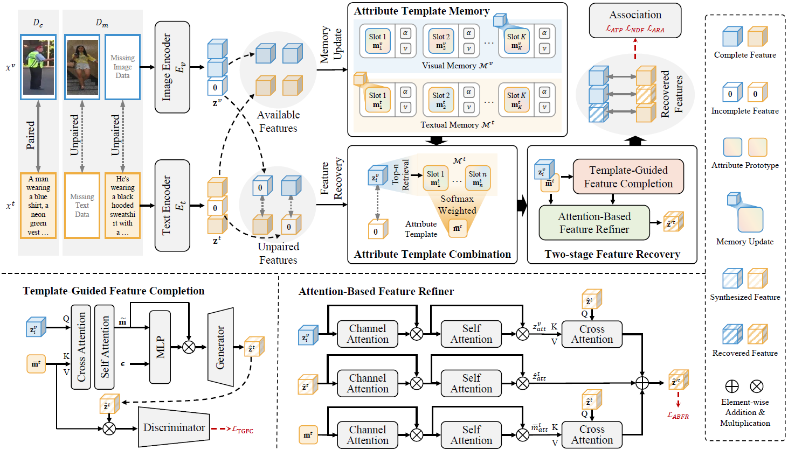

# Memory-Guided Completion Network for Text-based Person ReID with Incomplete Modality




## Abstract

Text-based person re-identification (TPReID) aims to retrieve pedestrian images from natural language descriptions by aligning textual semantics with visual person representations.
Existing TPReID methods generally assume fully paired image-text data during training.
In real-world scenarios, training data often contain incomplete samples with one missing modality, thereby weakening cross-modal supervision and degrading retrieval performance.
Existing incomplete-modality TPReID methods typically recover the missing modality from the available modality of the current sample by leveraging neighboring complete samples in the feature space.
Such instance-driven recovery is easily affected by sample-specific variations and cannot explicitly preserve the shared attribute structure that is crucial for identity matching.
To address this issue, we propose a Memory-Guided Completion Network (MGCN) for incomplete TPReID.
Specifically, we introduce an Attribute Template Memory (ATM) that learns attribute combination prototypes from complete samples and provides stable attribute priors for missing-modality recovery.
Based on this design, we develop a two-stage recovery method.
A Template-Guided Feature Completion (TGFC) module first generates the missing-modality feature under joint guidance from available identity information and attribute priors retrieved from ATM.
Then, an Attention-Based Feature Refiner (ABFR) further refines the recovered feature into a more discriminative representation for retrieval.
Experiments on three TPReID benchmarks across three incomplete-modality training settings demonstrate the effectiveness of the proposed method.


### Getting started

Clone this repo

```bash
git clone https://github.com/Qiangchen-cell/MGCN-master.git
```

Install dependencies

```bash
pip install -r requirements.txt
```

Any components in NLTK can be found [here](https://github.com/nltk/nltk_data/tree/gh-pages).


### Prepare pretrained model

Download pretrained baseline from [model_base](https://storage.googleapis.com/sfr-vision-language-research/BLIP/models/model_base.pth) from [BLIP](https://github.com/salesforce/BLIP) and put **model_base.pth** at **./checkpoint**.

The files shall be organized as:

```text
|---configs
|---data
|---models
|---datasets
|   |---CUHK-PEDES
|   |---ICFG-PEDES
|   |---RSTPReid
|---checkpoint
|   |---model_base.pth
```


### Prepare datasets

Download datasets: [CUHK-PEDES](https://github.com/ShuangLI59/Person-Search-with-Natural-Language-Description), [ICFG-PEDES](https://github.com/ShuangLI59/Person-Search-with-Natural-Language-Description), and [RSTPReid](https://github.com/NjtechCVLab/RSTPReid-Dataset), then put them at **./datasets**.

Please update the `image_root` field in each config file according to your local dataset path: configs/retrieval_cuhk.yaml, configs/retrieval_icfg.yaml, configs/retrieval_rstp.yaml
```
### Train
bash train.sh
```

You can change the dataset by modifying `--config` in `train.sh`.

If you have problem in downloading pretrained BERT models here:

```python
tokenizer = BertTokenizer.from_pretrained('bert-base-uncased')
```

you may manually download it from [Hugging Face](https://huggingface.co/docs/transformers/model_doc/bert#bert) and use this instead:

```python
tokenizer = BertTokenizer.from_pretrained(bert_localpath)
```


### Evaluation

Download MGCN checkpoints for the three datasets under the easy setting and put them at **./checkpoint**:

| Dataset | Checkpoint                                                                                               |
| --- |----------------------------------------------------------------------------------------------------------|
| CUHK-PEDES | [cuhk_easy_beast.pth](https://pan.baidu.com/s/1ZAbVMFbxmG9DVxDidNvx1g?pwd=0000) |
| ICFG-PEDES | [icfg_easy_best.pth](https://pan.baidu.com/s/1ZAbVMFbxmG9DVxDidNvx1g?pwd=0000)   |
| RSTPReid | [rstp_easy_best.pth](https://pan.baidu.com/s/1ZAbVMFbxmG9DVxDidNvx1g?pwd=0000)                                                            |

Evaluate on CUHK-PEDES:

```bash
python evaluate.py \
  --config ./configs/retrieval_cuhk.yaml \
  --checkpoint ./checkpoint/cuhk_easy_best.pth \
  --output_dir output/CUHK \
  --batch_size_test 64 \
  --k_test 32
```

Evaluate on ICFG-PEDES:

```bash
python evaluate.py \
  --config ./configs/retrieval_icfg.yaml \
  --checkpoint ./checkpoint/icfg_easy_best.pth \
  --output_dir output/ICFG \
  --batch_size_test 64 \
  --k_test 32
```

Evaluate on RSTPReid:

```bash
python evaluate.py \
  --config ./configs/retrieval_rstp.yaml \
  --checkpoint ./checkpoint/rstp_easy_best.pth \
  --output_dir output/RSTP \
  --batch_size_test 64 \
  --k_test 128
```


### Acknowledgments

Sincerely appreciate the contributions of [BLIP](https://github.com/salesforce/BLIP), [NLTK](https://github.com/nltk/nltk_data/tree/gh-pages), and [CADA](https://github.com/LinDixuan/CADA), for we used codes and pretrained models from these previous works.
